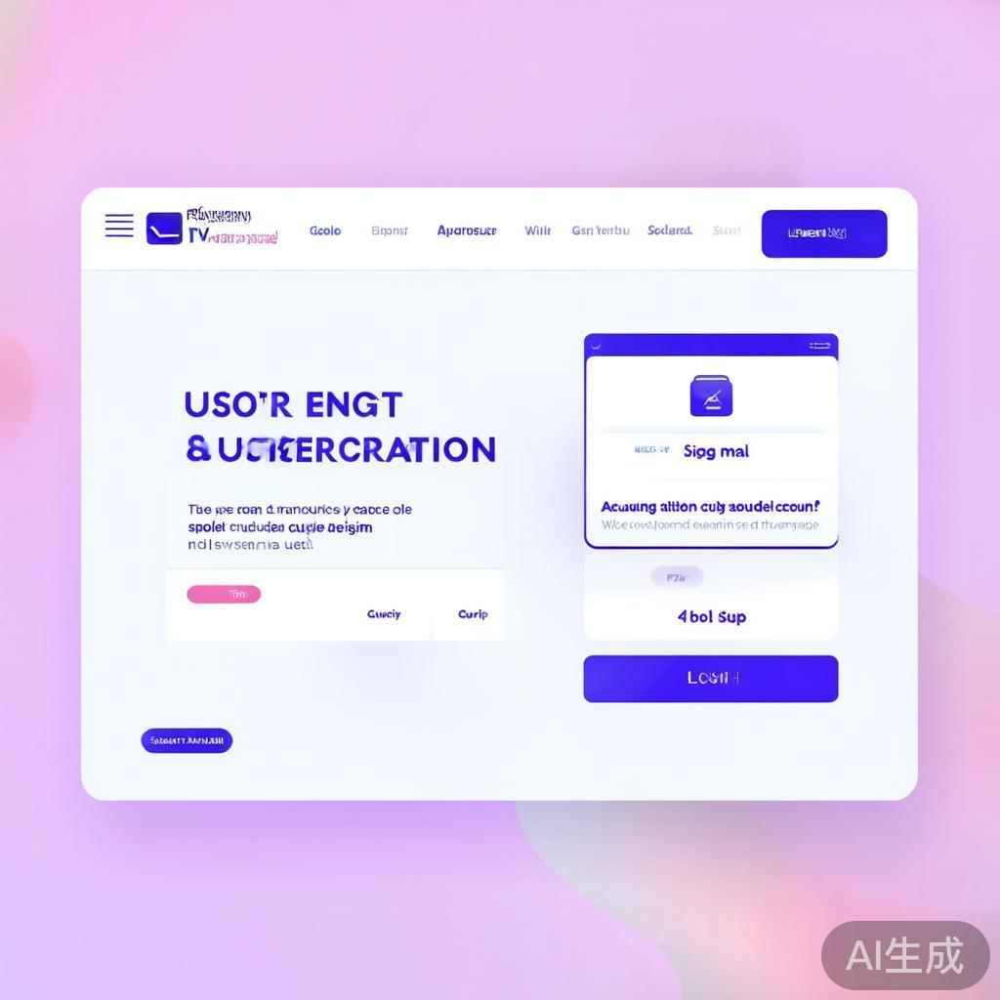
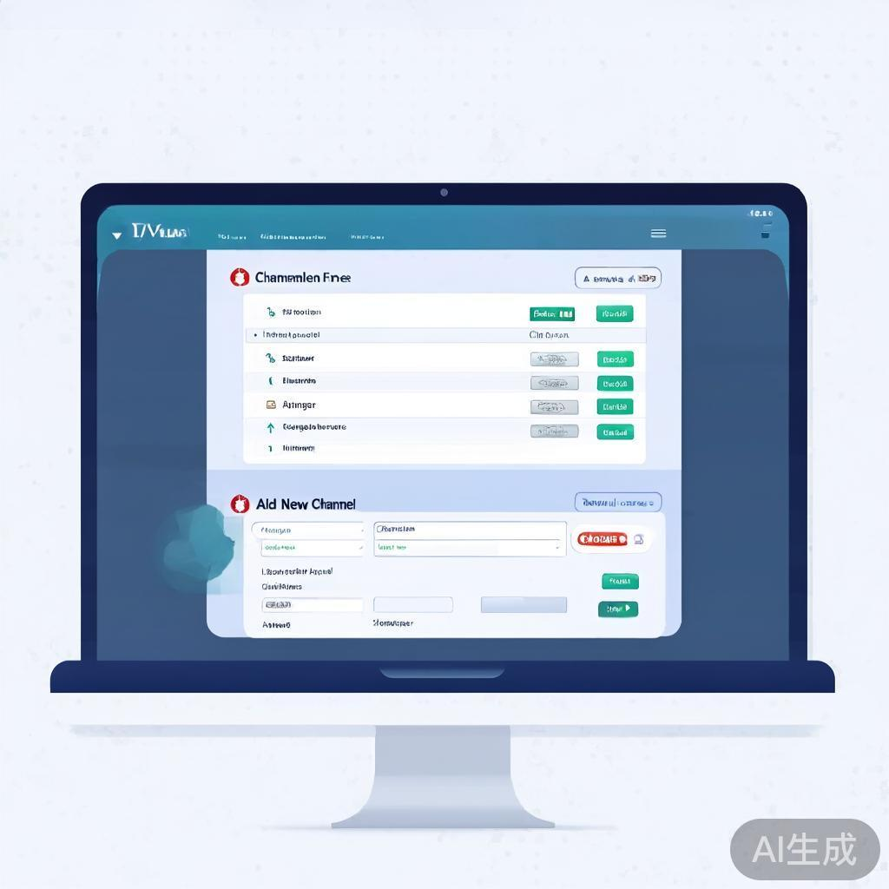
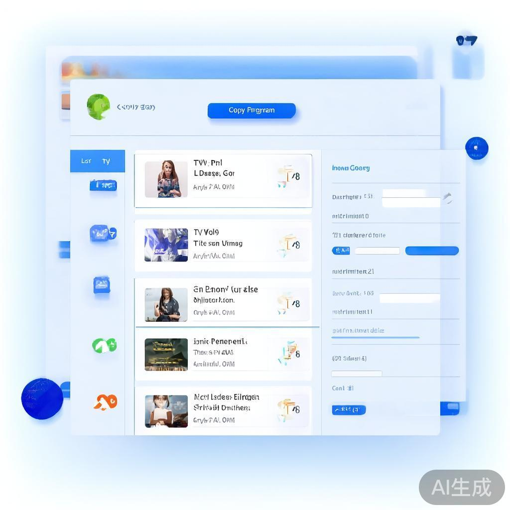
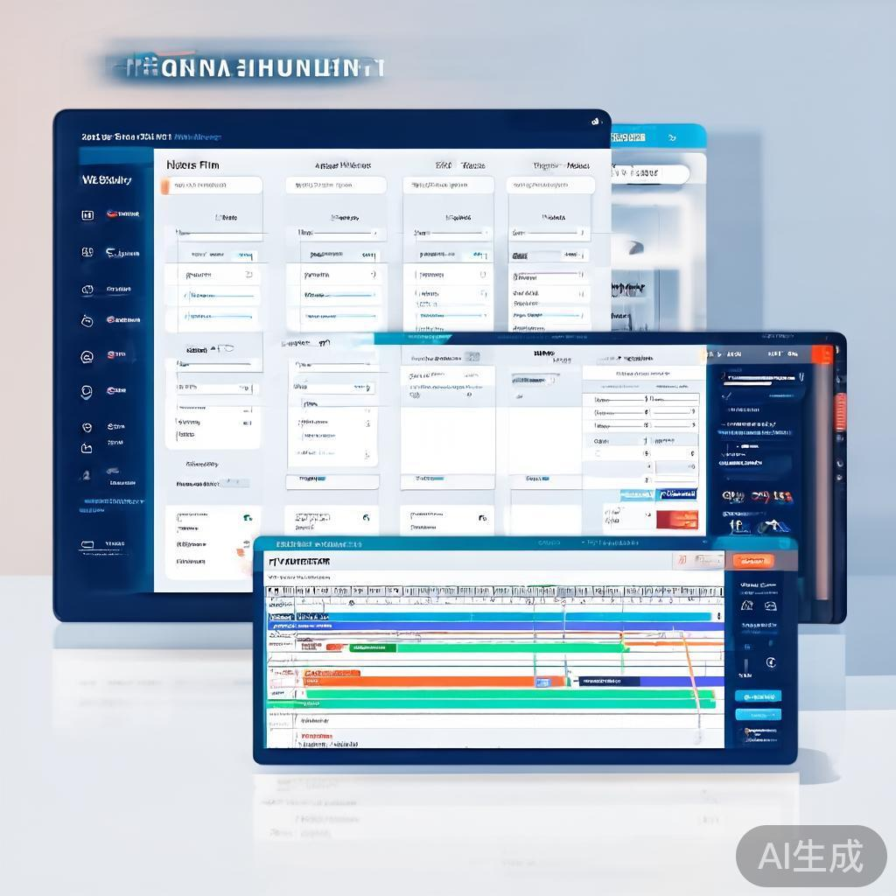
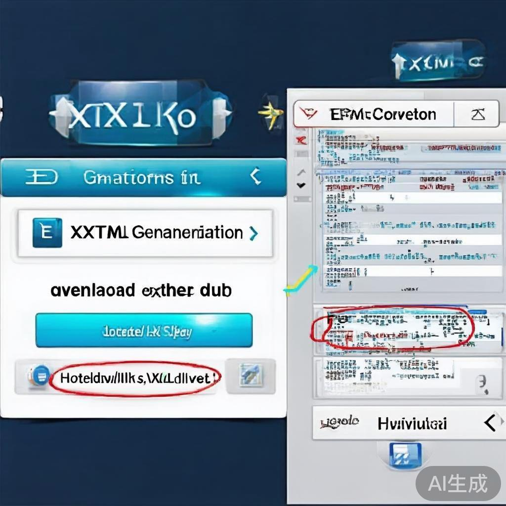
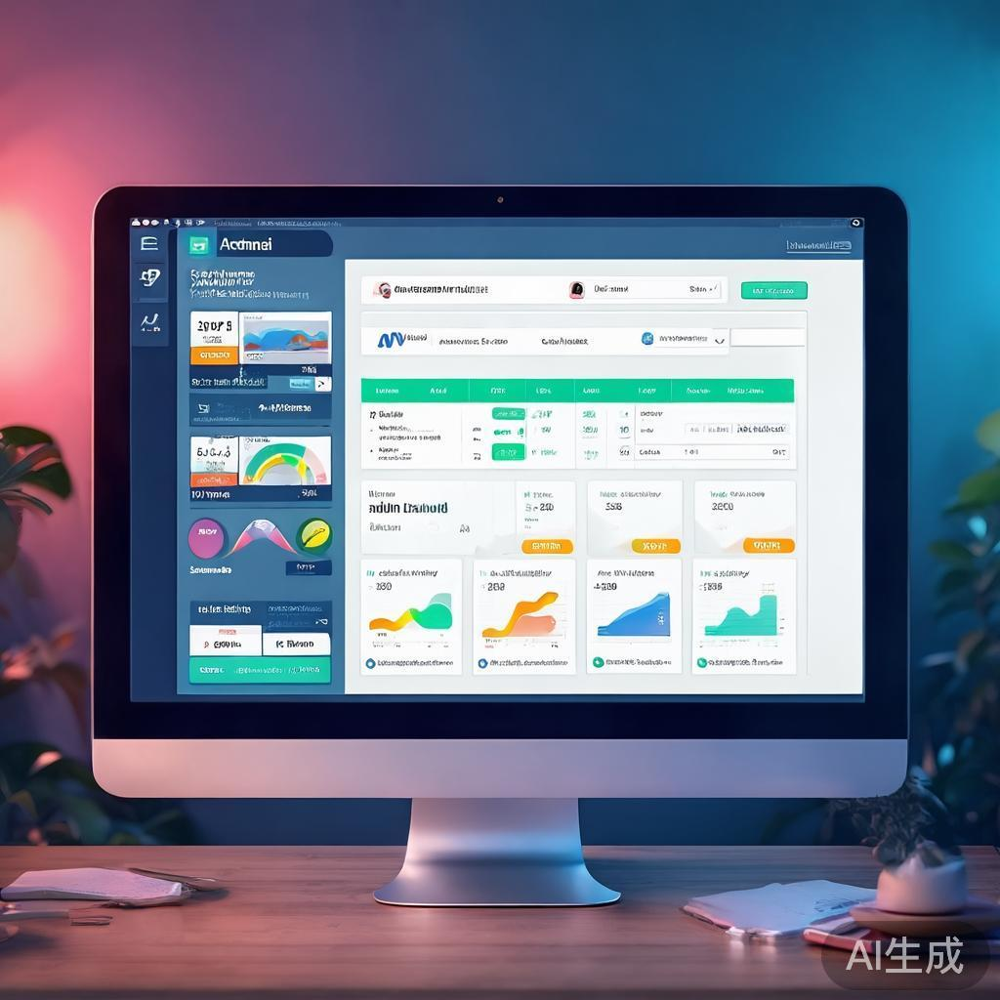
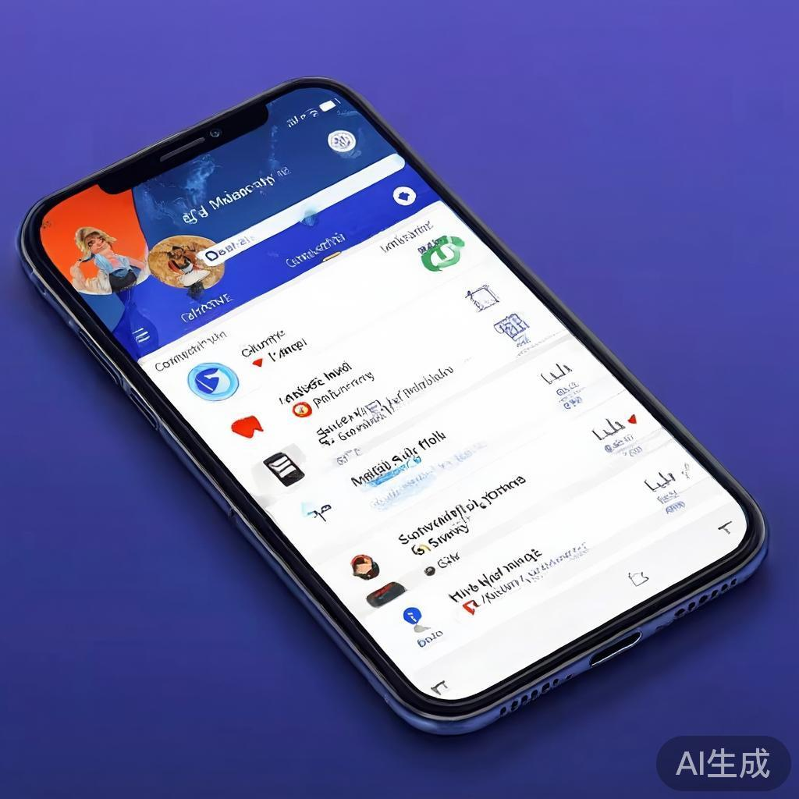

# 📺 EPG Manager - Electronic Program Guide Management System

A comprehensive EPG (Electronic Program Guide) management system designed specifically for live TV channel streamers and distributors. Create, manage, and host your electronic program guides with ease.

## ✨ Features

### 🎯 Core Functionality
- **🔐 User Authentication**: Secure login system with role-based access control
- **📺 Channel Management**: Create, edit, and manage TV channels with logos and metadata
- **🎬 Program Management**: Manage TV programs with categories, durations, and descriptions
- **📅 Schedule Management**: Schedule programs on specific channels with precise timing
- **📄 EPG Export**: Generate XMLTV format EPG files compatible with most TV systems
- **🌐 Hosted EPG**: Get permanent URLs for distributors with automatic updates
- **👥 Admin Panel**: Complete user management and system monitoring
- **📱 Responsive Design**: Mobile-first design that works on all devices

### 🚀 Key Features for TV Streamers
- **Multi-Client Support**: Each client has isolated data and management
- **Copy Programs**: Quickly duplicate programs to save time on repetitive entries
- **Bulk Operations**: Efficient management of multiple channels and programs
- **Real-time Updates**: Instant EPG generation and hosting
- **Distributor Ready**: Hosted URLs that automatically update with schedule changes

## 🛠️ Technology Stack

### Frontend
- **⚡ Next.js 15** - React framework with App Router
- **📘 TypeScript** - Type-safe JavaScript development
- **🎨 Tailwind CSS** - Utility-first CSS framework
- **🧩 shadcn/ui** - High-quality, accessible UI components
- **🎯 Lucide React** - Beautiful icon library
- **📱 React Hook Form** - Performant forms with validation
- **✅ Zod** - TypeScript-first schema validation

### Backend
- **🗄️ Prisma** - Next-generation ORM for database operations
- **🔐 NextAuth.js** - Complete authentication solution
- **🌐 REST APIs** - Clean and scalable API endpoints
- **📊 SQLite** - Lightweight database (easily replaceable with PostgreSQL/MySQL)

### Deployment
- **🚀 Vercel Ready** - One-click deployment
- **☁️ Railway Compatible** - Easy deployment with database
- **🔧 Environment Configured** - Production-ready settings

## 🚀 Quick Start

### Prerequisites
- Node.js 18+ 
- npm or yarn

### Local Development

```bash
# Clone the repository
git clone https://github.com/shihan84/epg-manager.git
cd epg-manager

# Install dependencies
npm install

# Set up database
npm run db:push
npm run db:seed

# Start development server
npm run dev
```

Open [http://localhost:3000](http://localhost:3000) to see the application.

### Demo Credentials
- **Admin User**: `admin@example.com` / `admin123`
- **Demo Client**: `demo@example.com` / `password`

## 📁 Project Structure

```
src/
├── app/                          # Next.js App Router
│   ├── (pages)/                  # Main application pages
│   │   ├── dashboard/           # User dashboard
│   │   ├── channels/            # Channel management
│   │   ├── programs/            # Program management
│   │   ├── schedules/           # Schedule management
│   │   ├── epg/                 # EPG export
│   │   ├── admin/               # Admin panel
│   │   └── auth/                # Authentication pages
│   └── api/                     # API endpoints
│       ├── auth/               # Authentication APIs
│       ├── channels/           # Channel management APIs
│       ├── programs/           # Program management APIs
│       ├── schedules/          # Schedule management APIs
│       ├── epg/                # EPG generation APIs
│       ├── dashboard/          # Dashboard stats API
│       └── admin/              # Admin management APIs
├── components/                  # React components
│   └── ui/                   # shadcn/ui components
├── hooks/                       # Custom React hooks
├── lib/                         # Utilities and configurations
├── types/                       # TypeScript definitions
└── prisma/                      # Database schema and migrations
```

## 📸 Interface Screenshots

### 🏠 Main Dashboard

*Clean, modern dashboard with real-time statistics and quick navigation*

### 👤 User Authentication

*Secure login and registration with professional branding*

### 📺 Channel Management

*Comprehensive channel management with edit/delete capabilities*

### 🎬 Program Management

*Program management with copy functionality and categorization*

### 📅 Schedule Management

*Advanced scheduling with calendar interface and timeline view*

### 📤 EPG Export

*XML generation, download options, and hosted URL distribution*

### 🛡️ Admin Panel

*System administration with user management and statistics*

### 📱 Mobile Responsive Design

*Touch-friendly mobile interface for on-the-go management*

---

## 🎯 How to Use

### For TV Channel Streamers

#### 1. **Account Setup**
- Sign up for a new account at `/auth/signup`
- Verify your email and log in at `/auth/signin`

#### 2. **Channel Management**
- Navigate to `/channels`
- Add your TV channels with:
  - Channel name and display name
  - Description and category
  - Logo URL and streaming URL
  - Channel number for sorting

#### 3. **Program Management**
- Go to `/programs`
- Create TV programs with:
  - Title and description
  - Category and duration
  - Image URL for thumbnails
  - Use the **Copy** feature to duplicate similar programs

#### 4. **Schedule Creation**
- Visit `/schedules`
- Schedule programs on channels:
  - Select channel and program
  - Set start and end times
  - Mark live broadcasts and new episodes
  - Auto-calculation of end times based on duration

#### 5. **EPG Generation**
- Go to `/epg`
- Generate your EPG in XMLTV format:
  - Click "Generate EPG" to create fresh EPG data
  - Download XML files for local use
  - Get hosted URLs for distributors
  - Preview EPG content before downloading

#### 6. **Share with Distributors**
- Use the hosted EPG URLs for automatic updates
- Download XML files for systems that require local files
- Regenerate EPG whenever you update your schedules

### For Administrators

#### 1. **Admin Access**
- Log in with admin credentials
- Access admin panel at `/admin`

#### 2. **User Management**
- View all registered users
- Monitor user activity and statistics
- Activate/deactivate user accounts
- View system-wide EPG data

#### 3. **System Monitoring**
- Track total users, channels, programs, and schedules
- Monitor recent user registrations
- View platform-wide statistics

## 🌐 Deployment Guide

### Vercel Deployment (Recommended)

#### 1. **Connect Repository**
- Push your code to GitHub
- Connect your GitHub repository to Vercel
- Import the `epg-manager` repository

#### 2. **Configure Environment Variables**
In Vercel dashboard, add these environment variables:

```env
DATABASE_URL=your_database_connection_string
NEXTAUTH_URL=https://your-app.vercel.app
NEXTAUTH_SECRET=your_random_secret_key
```

#### 3. **Database Setup**
- **Option 1**: Use Vercel Postgres (recommended for production)
- **Option 2**: Use external database (PostgreSQL, MySQL)
- **Option 3**: Use SQLite (for development/small deployments)

#### 4. **Deploy**
- Click "Deploy" - Vercel will automatically detect Next.js
- Wait for deployment to complete
- Your app will be available at `https://your-app.vercel.app`

#### 5. **Post-Deployment**
- Run database migrations if using PostgreSQL/MySQL
- Test all features in production environment
- Set up custom domain if needed

### Railway Deployment

#### 1. **Connect Repository**
- Sign up for Railway account
- Connect your GitHub repository
- Select `epg-manager` repository

#### 2. **Configure Service**
- Railway will automatically detect Next.js
- Configure build command: `npm run build`
- Configure start command: `npm start`

#### 3. **Set Environment Variables**
```env
DATABASE_URL=${{RAILWAY_ENVIRONMENT.DATABASE_URL}}
NEXTAUTH_URL=${{RAILWAY_ENVIRONMENT.RAILWAY_PUBLIC_DOMAIN}}
NEXTAUTH_SECRET=${{RAILWAY_ENVIRONMENT.NEXTAUTH_SECRET}}
```

#### 4. **Deploy**
- Railway will automatically deploy on push
- Your app will be available at Railway-provided URL

### Netlify Deployment

#### 1. **Build Setup**
- Connect repository to Netlify
- Configure build settings:
  - Build command: `npm run build`
  - Publish directory: `.next`

#### 2. **Environment Variables**
Add environment variables in Netlify dashboard:
```env
DATABASE_URL=your_database_url
NEXTAUTH_URL=https://your-app.netlify.app
NEXTAUTH_SECRET=your_secret_key
```

#### 3. **Deploy**
- Netlify will automatically deploy on push
- Note: You may need to configure serverless functions for API routes

### Docker Deployment

#### 1. **Create Dockerfile**
```dockerfile
FROM node:18-alpine

WORKDIR /app

COPY package*.json ./
RUN npm ci --only=production

COPY . .
RUN npm run build

EXPOSE 3000

CMD ["npm", "start"]
```

#### 2. **Build and Run**
```bash
docker build -t epg-manager .
docker run -p 3000:3000 -e DATABASE_URL=your_db_url epg-manager
```

## 🔧 Configuration

### Environment Variables

| Variable | Description | Required | Default |
|----------|-------------|----------|---------|
| `DATABASE_URL` | Database connection string | Yes | - |
| `NEXTAUTH_URL` | URL of your application | Yes | `http://localhost:3000` |
| `NEXTAUTH_SECRET` | Secret for JWT signing | Yes | - |
| `NEXT_PUBLIC_BASE_URL` | Public URL for hosted EPG | No | `http://localhost:3000` |

### Database Setup

#### SQLite (Development)
```bash
npm run db:push    # Push schema to SQLite
npm run db:seed    # Seed with demo data
```

#### PostgreSQL (Production)
```bash
npm install pg        # Install PostgreSQL driver
# Update DATABASE_URL to PostgreSQL connection string
npm run db:migrate   # Run migrations
npm run db:seed     # Seed with demo data
```

## 🎨 Customization

### Branding
- Update `src/app/layout.tsx` for site metadata
- Replace logo in `public/` directory
- Customize colors in Tailwind configuration

### Features
- Add new fields to Prisma schema
- Extend API endpoints as needed
- Customize UI components in `src/components/ui/`

### Deployment
- Add custom domains
- Configure SSL certificates
- Set up monitoring and analytics

## 🤝 Contributing

1. Fork the repository
2. Create a feature branch (`git checkout -b feature/amazing-feature`)
3. Commit your changes (`git commit -m 'Add some amazing feature'`)
4. Push to the branch (`git push origin feature/amazing-feature`)
5. Open a Pull Request

## 📄 License

This project is licensed under the MIT License - see the [LICENSE](LICENSE) file for details.

## 🚀 Support

For support and questions:
- Create an issue in the GitHub repository
- Check the documentation in the wiki
- Contact the development team

## 🎯 Roadmap

### Phase 1 (Current)
- ✅ Core EPG management system
- ✅ User authentication and roles
- ✅ Channel and program management
- ✅ Schedule management
- ✅ EPG export and hosting
- ✅ Admin panel

### Phase 2 (Future)
- 🔄 Multi-language support
- 🔄 Advanced scheduling (recurring programs)
- 🔄 EPG validation and testing tools
- 🔄 Integration with popular TV systems
- 🔄 Mobile app companion

### Phase 3 (Advanced)
- 🔄 Real-time collaboration
- 🔄 Advanced analytics and reporting
- 🔄 API rate limiting and security
- 🔄 Enterprise features
- 🔄 White-label solution

---

Built with ❤️ for TV channel streamers and distributors worldwide.

**EPG Manager** - Streamline your electronic program guide management today! 📺✨