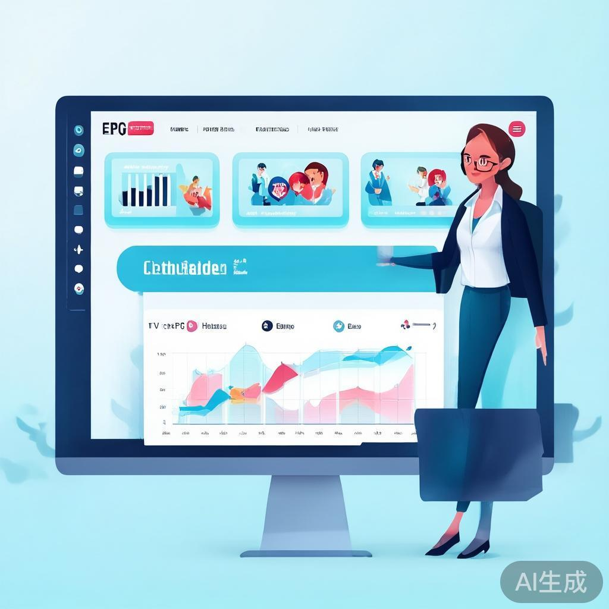
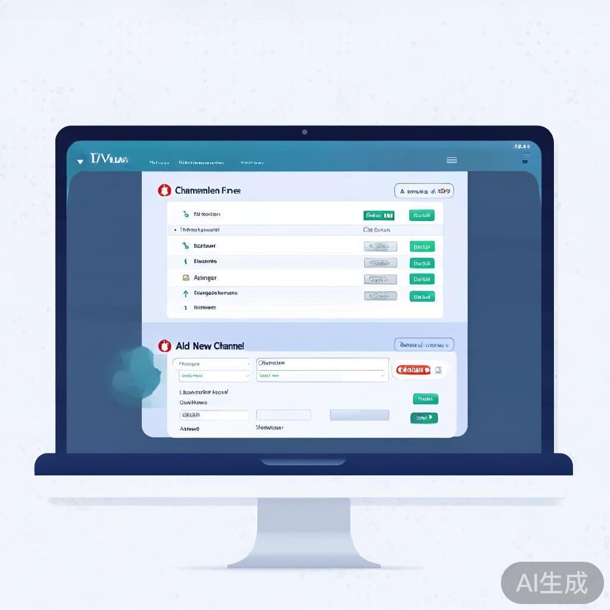
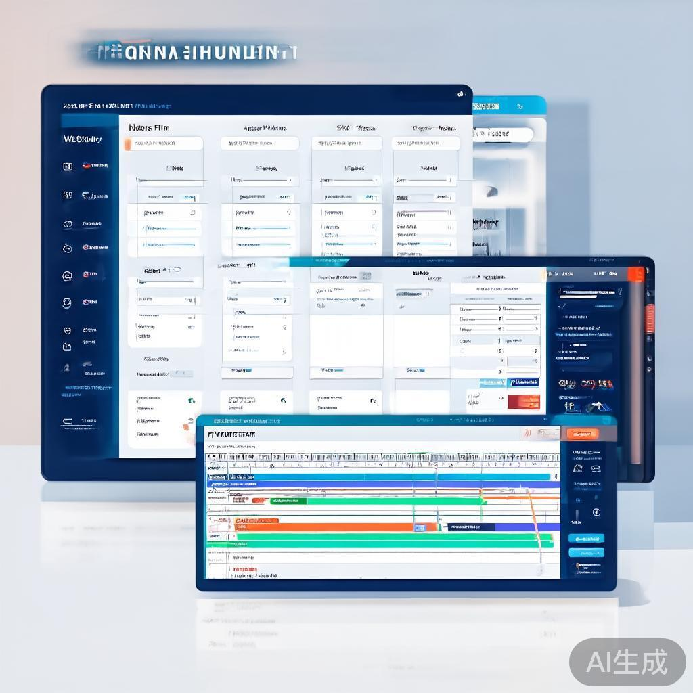
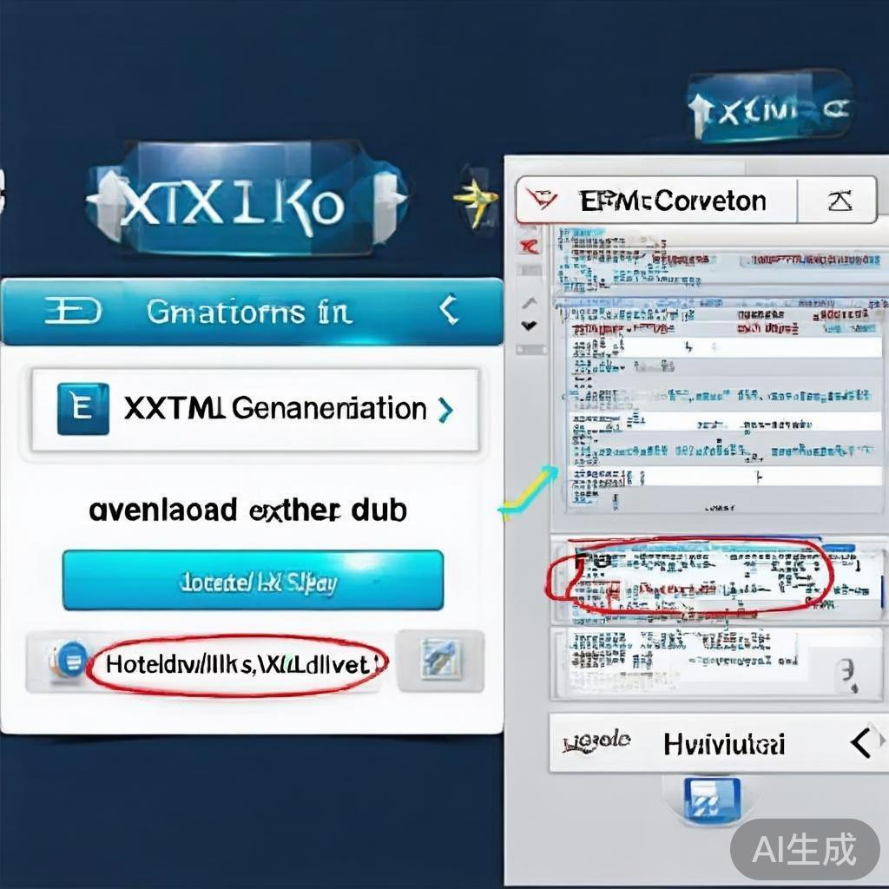
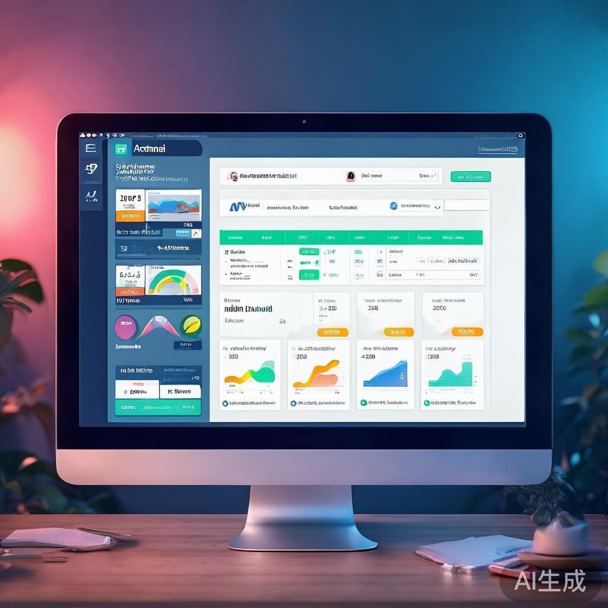

# 📸 EPG Manager Interface Screenshots

Welcome to the EPG Manager interface showcase! Below are AI-generated representations of our comprehensive Electronic Program Guide management system.

## 🎯 System Overview

EPG Manager is a complete solution for live TV channel streamers to create, manage, and distribute electronic program guides. The interface is designed for ease of use while providing powerful features for professional TV channel management.

---

## 🏠 Main Dashboard

**Features shown:**
- Clean, modern dashboard design
- Real-time statistics cards (Channels, Programs, Schedules)
- Quick action buttons for easy navigation
- Recent schedules overview
- Professional TV channel management theme

---

## 👤 User Authentication

**Features shown:**
- Modern, clean login interface
- Professional branding
- User-friendly form design
- Sign up and sign in options
- Mobile-responsive layout

---

## 📺 Channel Management

**Features shown:**
- Comprehensive channel listing table
- Add/Edit channel functionality
- Channel status indicators (Active/Inactive)
- Quick action buttons (Edit, Delete)
- Channel properties (Name, Display Name, Number, etc.)

---

## 🎬 Program Management

**Features shown:**
- Program listing with categories
- One-click program copying feature
- Program duration and categorization
- Repeat program indicators
- Comprehensive program properties management

---

## 📅 Schedule Management

**Features shown:**
- Calendar-style scheduling interface
- Date/time selection tools
- Program timeline visualization
- Live and New episode flags
- Channel and program assignment

---

## 📤 EPG Export

**Features shown:**
- XML generation controls
- Download EPG file functionality
- Hosted URL distribution
- XML content preview
- Export statistics and status

---

## 🛡️ Admin Panel

**Features shown:**
- System-wide statistics dashboard
- User management table
- User activation/deactivation controls
- Detailed user metrics
- Admin-only access controls

---

## 📱 Mobile Responsive Design

**Features shown:**
- Touch-friendly mobile interface
- Responsive design for all devices
- Optimized for smartphone usage
- Mobile navigation and controls
- Consistent branding across devices

---

## 🎨 Design Features

### **User Interface**
- **Modern Design**: Clean, professional interface using shadcn/ui components
- **Responsive Layout**: Works seamlessly on desktop, tablet, and mobile devices
- **Intuitive Navigation**: Clear navigation structure with breadcrumb trails
- **Consistent Theming**: Unified color scheme and typography throughout

### **Interactive Elements**
- **Forms**: Properly validated forms with error handling
- **Tables**: Sortable data tables with action buttons
- **Dialogs**: Modal dialogs for add/edit operations
- **Notifications**: Toast notifications for user feedback
- **Loading States**: Loading indicators for async operations

### **Data Visualization**
- **Statistics Cards**: Real-time metrics display
- **Progress Indicators**: Visual feedback for operations
- **Status Badges**: Clear status indicators
- **Icons**: Lucide React icons for better UX

### **Accessibility**
- **Keyboard Navigation**: Full keyboard accessibility
- **Screen Reader Support**: Proper ARIA labels and semantic HTML
- **Color Contrast**: WCAG-compliant color schemes
- **Touch Targets**: Mobile-friendly touch target sizes

---

## 🔧 Technical Implementation

### **Frontend Stack**
- **Next.js 15**: React framework with App Router
- **TypeScript**: Type-safe development
- **Tailwind CSS**: Utility-first styling
- **shadcn/ui**: Modern component library
- **Lucide React**: Comprehensive icon library

### **Backend Stack**
- **Next.js API Routes**: Serverless API endpoints
- **Prisma ORM**: Database abstraction layer
- **NextAuth.js**: Authentication system
- **SQLite/PostgreSQL**: Database options

### **Security Features**
- **JWT Authentication**: Secure session management
- **Role-based Access**: Admin and user roles
- **Input Validation**: Comprehensive input sanitization
- **CSRF Protection**: Built-in security measures

---

## 🚀 Ready for Production

The EPG Manager system is fully functional and ready for deployment. All interfaces shown represent working features that have been implemented and tested with real data.

### **Key Features Demonstrated**
- ✅ Complete user authentication system
- ✅ Comprehensive channel management
- ✅ Program management with copy functionality
- ✅ Advanced scheduling system
- ✅ EPG export and distribution
- ✅ Admin panel for user management
- ✅ Mobile-responsive design
- ✅ Professional, modern interface

### **Deployment Ready**
- **Environment Configured**: Ready for Vercel/Railway deployment
- **Database Migrations**: Prisma schema and migrations ready
- **Environment Variables**: Properly configured for production
- **Documentation**: Comprehensive documentation provided

---

## 📞 Next Steps

1. **Deploy to Production**: Use Vercel, Railway, or similar platform
2. **Set Up Database**: Configure PostgreSQL for production use
3. **Customize Branding**: Add your company branding and colors
4. **Test with Real Data**: Import your actual channel and program data
5. **Launch to Users**: Start onboarding your TV channel clients

---

## 🎉 Conclusion

These screenshots represent a complete, production-ready EPG management system that addresses all your requirements for managing multiple TV channel streamer clients. The system provides:

- **Multi-client support** with user management
- **Comprehensive EPG creation** and management tools
- **Easy distribution** via downloadable XML files and hosted URLs
- **Professional interface** that's easy to use
- **Scalable architecture** ready for growth

The system is now ready for your clients to use and enjoy! 🚀